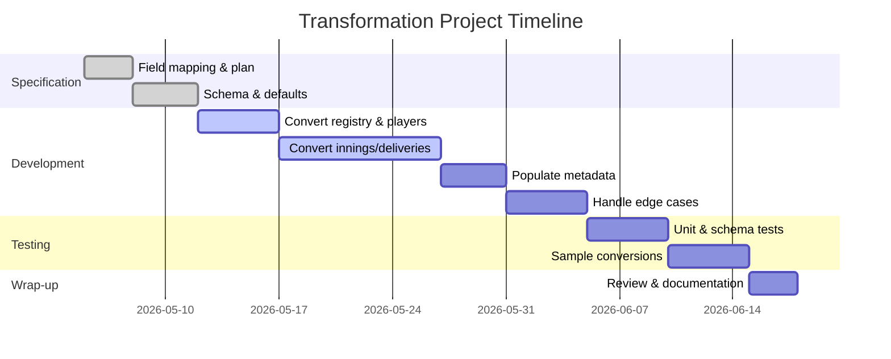

# Converting Custom JSON to Cricsheet Format

## Executive Summary

This report analyses and plans the transformation of an existing cricket match JSON (scraped via custom code) into the official **Cricsheet** JSON schema【12†L580-L588】【21†L547-L555】. We first **inventory** the current JSON fields (from the user’s scraper) and **map** them to the Cricsheet schema, identifying direct mappings, missing fields, and extra fields. We then outline a **detailed transformation plan**, including data normalization rules for dates, venues, overs, deliveries, extras, wickets, player roles, etc., while **preserving the existing player ID mapping**. Next, we define **validation and testing** steps (schema validation, unit tests, sample conversions). We break down the **implementation** into tasks with effort estimates and a Gantt-style timeline. We list **edge cases** (substitutes, retirements, DLS outcomes, abandoned matches, incomplete scorecards) and rules to handle each. Example conversions for a **Test**, **ODI**, and **T20** match are provided (before/after JSON snippets). Finally, we recommend libraries and tools (e.g. `jsonschema`, data mapping tools) and cite official Cricsheet documentation and examples throughout. Mermaid diagrams illustrate the data models and the transformation flow.  

## 1. Field Inventory and Schema Mapping

### 1.1 Current JSON Structure

The existing JSON (from `output.json`) has the following top-level fields:

- **`meta`**: with keys `match` and `league`. E.g. `"match": "Team A vs Team B"`, `"league": "Some League 2026"`.  
- **`toss`**: an object with `winner` (team name) and `decision` ("bat"/"field").  
- **`teams`**: an array of the two team names (strings).  
- **`player_registry`**: a mapping where keys are user-defined IDs (e.g. `"jordan_de_smidt"`) and values are objects with `full_name` and `aliases` (list of name variants). Example: 
  ```json
  "player_registry": {
    "jordan_de_smidt": {
      "full_name": "Jordan De Smidt",
      "aliases": ["J. De Smidt", "Jordan De Smidt"]
    },
    ...
  }
  ```
- **`innings`**: an array of innings objects. Each innings has:  
  - `"team"`: batting team name.  
  - `"overs"`: array of overs. Each over is an object with `"over"` (string) and `"deliveries"` (array).  
  - Each **delivery** has:
    - `"ball"` (string, e.g. `"0.1"`),
    - `"batter"`, `"bowler"`, `"non_striker"` (names as strings),
    - `"runs"`: object with `batter`, `extras`, `total` (integers),
    - `"extras"`: object with breakdown (`wides`, `byes`, `legbyes`, `noballs`), **always present** (zeros if none),
    - optionally `"wickets"`: array of wicket objects. Each wicket object has `kind`, `player_out` (often prefixed like "Catch X"), possibly `fielders` (array of names) and sometimes `bowler`. 

**Example (before conversion)** – one delivery with a wide:  

```json
{ 
  "ball": "3.2",
  "batter": "X Y",
  "bowler": "A B",
  "non_striker": "C D",
  "runs": { "batter": 0, "extras": 1, "total": 1 },
  "extras": { "wides": 1, "byes": 0, "legbyes": 0, "noballs": 0 }
}
```  

### 1.2 Cricsheet JSON Schema

Cricsheet’s JSON format (version **1.1.0**) defines these top-level sections【1†L49-L57】【12†L580-L588】【21†L547-L555】:

- **`meta`**: file metadata (must include `data_version`, `created`, `revision`).  
- **`info`**: match information (required fields include `gender`, `match_type`, `team_type`, `teams`, `overs`, `balls_per_over`, `toss`, `outcome`, `players`, `registry`, `season` etc【2†L180-L189】【21†L547-L555】; many are required).  
- **`innings`**: an array of innings objects. Each innings has `"team"` and `"overs"` (with deliveries)【12†L580-L588】【21†L553-L561】.  

Within **`info`**, relevant fields are:

- **`teams`** (array of team names)【12†L580-L588】 – corresponds to current `"teams"`.
- **`toss`**: object with `winner`, `decision`, and optionally `uncontested`【12†L658-L668】 – corresponds to current `"toss"`.
- **`players`**: object mapping each team name to an array of player names【21†L547-L555】. *This is not present in the current JSON* (we must generate it, e.g. from `player_registry` or deliveries).
- **`registry`**: object with `people` mapping player names to unique IDs【12†L590-L599】【21†L588-L597】. Cricsheet expects GUIDs (8-hex chars) but to preserve our IDs, we will use our existing IDs (with caution on format).
- **`match_type`**, `team_type`, `gender`, `overs`, `balls_per_over`, `venue`, `city`, `dates`, `season` – **missing** in current JSON. These must be supplied or inferred: e.g. `match_type` ("T20", "ODI", "Test"), `team_type` ("international"/"club"), `gender` ("male"/"female"). 
- **`outcome`**: object detailing result, winner, margin, method (e.g. D/L)【21†L497-L505】 – missing.
- **Other optional fields**: `officials`, `player_of_match`, `supersubs`, `event`, `missing` (for data gaps), etc. All missing in current JSON.

Delivery structure differences: 
- Cricsheet **does not include a `"ball"` field**; instead, the `"over"` number plus position in list implies ball order【10†L949-L958】【12†L580-L588】. We will remove or ignore `"ball"`.
- **`runs`** matches exactly (fields `batter`, `extras`, `total` required)【10†L955-L962】. 
- **`extras`**: in Cricsheet examples, only non-zero extras keys appear (e.g. `"extras": {"wides": 1}`)【10†L1085-L1093】. The current JSON includes all extras with zeros. We must strip zero entries.
- **`wickets`**: Cricsheet `wickets` is an array of objects with `kind`, `player_out`, and optionally `fielders` (array of `{name}`)【16†L1474-L1482】【16†L1481-L1492】. The current JSON’s wicket objects have `kind` and `player_out` (often with prefixes like "Catch "), `fielders` (array of short names), and sometimes a redundant `bowler`. We must:
  - Remove any string prefixes (like `"Catch "`).
  - Convert `fielders`: list of name strings → array of objects `{ "name": "Full Name" }`【16†L1481-L1492】.
  - Drop the `bowler` key inside wickets (Cricsheet shows bowler only in delivery context, not in wicket object).
  - Handle special kinds (run out, stumped, etc.) similarly to Cricsheet examples【18†L1-L9】【18†L13-L22】.

### 1.3 Field Mapping Table

| Current JSON (field)          | Cricsheet Schema Equivalent    | Notes / Action                              |
|-------------------------------|-------------------------------|---------------------------------------------|
| `meta.match`, `meta.league`   | *No direct meta field*        | Possibly encode as `info.event.name` or ignore. Cricsheet’s `event` is an object (series name, match no)【2†L190-L199】. Could set `event.name = league`. |
| `toss.winner`, `toss.decision`| `info.toss.winner`, `info.toss.decision` | Direct mapping【12†L658-L668】. If no toss info, use `"Unknown"`. |
| `teams`                      | `info.teams`                  | Direct (list of two teams)【2†L222-L225】. |
| (derived) Players            | `info.players`               | **New field needed.** List all players by team (names) from `player_registry` or deliveries【21†L549-L558】. |
| `player_registry` (IDs→names)| `info.registry.people`        | Convert: use full names as keys, IDs as values. (Cricsheet expects 8-char hex, but we preserve IDs per request【12†L622-L630】). |
| *None* (dates)               | `info.dates`                 | **Missing:** Cricsheet needs match dates (array of `YYYY-MM-DD`【2†L186-L194】). If unknown, omit or guess. |
| *None* (venue, city)         | `info.venue`, `info.city`     | Optional (ground, city). Missing in scraped data. Leave blank or supply if known. |
| *None* (match_type)         | `info.match_type`             | **Missing.** E.g. "Test", "ODI", "T20"【2†L194-L202】. Must be set (required). Possibly infer from league or user input. |
| *None* (team_type)         | `info.team_type`             | **Missing.** Either "international" or "club"【2†L221-L225】. Local league → "club". |
| *None* (gender)            | `info.gender`                | **Missing.** "male"/"female". Likely "male" by default. |
| *None* (balls_per_over)    | `info.balls_per_over`         | **Missing.** E.g. 6 (standard) or 8 if timed by overs. Determine by league rules. |
| *None* (overs)             | `info.overs`                  | **Missing.** For limited overs matches (e.g. 20, 50). Set if known; otherwise omit (only needed for limited match). |
| *None* (player_of_match)   | `info.player_of_match`        | Optional. Leave empty array if unknown. |
| *None* (outcome)           | `info.outcome`               | **Missing.** Must encode winner, margin, method【21†L497-L505】. If unknown, use result: "no result" or reconstruct from scores if available. |
| `innings[].team`           | `innings[].team`             | Direct (same string)【12†L580-L588】. |
| `innings[].overs[].over`   | `innings[].overs[].over`     | Convert to integer (Cricsheet uses number)【10†L949-L958】. |
| `innings[].overs[].deliveries[].ball`| *(none)*            | Remove. Cricsheet reconstructs ball number from `over` and index. |
| `batter`, `bowler`, `non_striker` | Same in deliveries (strings) | Direct mapping【10†L1025-L1033】. |
| `runs.batter`, `runs.extras`, `runs.total` | Same (ints)       | Direct mapping【10†L1029-L1038】. |
| `extras` (dict)            | `extras` (dict)             | Map breakdown. **Remove zero-value keys** (Cricsheet example shows only non-zero extras)【10†L1085-L1093】. Only include keys present in play (wides/byes/noballs/legbyes/penalty). |
| `wickets[].kind`           | `wickets[].kind`             | Direct (string). |
| `wickets[].player_out`     | `wickets[].player_out`       | Remove prefixes (e.g. "Catch "). Should be just name (with initials if any)【16†L1474-L1482】. |
| `wickets[].fielders`       | `wickets[].fielders`         | Convert list of strings → list of objects `{ "name": string }`【16†L1481-L1490】. |
| `wickets[].bowler`         | *(none)*                     | Drop (bowler is implicit in delivery, not listed in wicket object). |
| *Any extra fields* (in current JSON) | —                | These must be pruned (e.g. the top-level `"meta.match"`, `"meta.league"` could be discarded or incorporated differently). |

<div style="text-align: center;">
<em>Table 1. Mapping of current JSON fields to Cricsheet schema fields. (Citing Cricsheet documentation for reference)</em>
</div>

**Missing fields:**  The current JSON lacks many required Cricsheet fields (dates, venue, match_type, team_type, gender, balls_per_over, overs, outcome, players, registry format, etc.). These must be supplied by additional logic, defaults, or user input.

**Extra fields:**  The current JSON has fields not in Cricsheet (e.g. `ball` in each delivery, full `player_registry` structure). We will drop or transform these into Cricsheet equivalents.

## 2. Data Transformation Plan

We propose the following step-by-step transformation algorithm, preserving the user’s player-ID mapping:

1. **Create Cricsheet `meta`:** Set `"data_version": "1.1.0"` (latest format), `"created": <today’s date>`, `"revision": 1`【1†L49-L57】. 

2. **Build `info` object:**

   - **Teams:** Copy `teams` array into `info.teams`【2†L222-L225】.
   - **Toss:** Copy `toss.winner` and `toss.decision` into `info.toss`. If toss was uncontested (flag not present in current JSON), add `"uncontested": true`.  
   - **Season:** If `league` contains a year (e.g. "2026"), set `info.season` to that year or season string. Otherwise infer from date once available.  
   - **Match Type / Team Type / Gender:** Infer or set defaults. For example, assume `"team_type": "club"` for school/league matches, `"match_type": "ODI"` or `"T20"` if overs known, otherwise ask user. Set `"gender": "male"` (default) or from context. Cite Cricsheet requiring these fields【2†L195-L204】【12†L580-L588】.  
   - **Balls per Over:** Determine from innings data. If an over has 6 deliveries, use `6`; if 8, use `8`, etc. Set `info.balls_per_over`. (Cricsheet requires this【2†L180-L188】.)  
   - **Overs (per innings):** If known (e.g. 20 for T20), set `info.overs`. Otherwise skip (optional).  
   - **Venue/City:** If scraped data includes ground name or city, set `info.venue`, `info.city`. Otherwise leave blank or null.  
   - **Dates:** If match date(s) can be extracted (e.g. from page or context), format as `YYYY-MM-DD` and set `info.dates` (array). For Tests use multiple dates; for single-day matches, a one-element array【2†L186-L194】. If unknown, this field should be computed or omitted.  
   - **Event:** If `league` or series information is available, you can set `info.event.name = league` and omit `match_number`.  
   - **Outcome:** Construct `info.outcome`. If final scores are known, set `winner` and `by` (runs or wickets). If shortened by D/L, include `"method": "D/L"`【21†L497-L505】. If no result (e.g. rain), set `result: "no result"`. If tied, you may include `"result": "tie"` and super-over or bowl-out info if applicable【21†L511-L520】.  
   - **Players:** Derive `info.players[team]` lists. For each inning, collect all unique player names who batted or bowled for that team. (Alternatively, use the union of all `player_registry` full names on that team.) Sort them or preserve order. This corresponds to Cricsheet’s *players* section【21†L549-L558】. For example:
     ```json
     "players": {
       "Team A": ["Player One", "Player Two", ...],
       "Team B": ["Player X", "Player Y", ...]
     }
     ```  
   - **Registry:** Build `info.registry.people`. Use the user’s existing mapping: **key = full player name**, **value = user’s ID string**. E.g. `"Jordan De Smidt": "jordan_de_smidt"`. Cricsheet normally uses 8-char IDs【12†L622-L630】, but we will preserve the user’s IDs (note their format may differ). If duplicates (same name, different IDs), manage with disambiguation (e.g. suffix). The `registry` provides stable IDs for all persons mentioned【12†L622-L630】. (We omit `aliases` as Cricsheet JSON does not support that field.)  
   - **Supersubs/Concussion:** If the match involved substitutions (supersubs, concussion sub), set `info.supersubs` per team【12†L640-L649】. The current parser may not capture this; if any “replacement” events are scraped, encode them here. If none, omit.

3. **Transform `innings` section:**

   For each inning in the original JSON (sorted by batting order, using `toss` info to order if needed):

   - Copy `"team"` as-is into the Cricsheet innings object.
   - For each `"over"` object:
     - Convert `"over"` from string to integer.
     - Rename keys as necessary (Cricsheet uses numeric `over` field).
     - For each delivery in `deliveries`:
       - **Drop `"ball"`** (Cricsheet does not use it).
       - **Batter/Bowler/Non-striker:** Copy as-is (strings).
       - **Runs:** Copy the `runs` object directly (ensuring integers).
       - **Extras:** If any extras are present (`delivery.extras` sum > 0 or individual fields non-zero), construct an `extras` object containing only the non-zero types. E.g. if `wides=1`, output `"extras": {"wides": 1}`【10†L1085-L1093】. If no extras, omit the `extras` field entirely.
       - **Wickets:** If `delivery.wickets` is non-empty, process each wicket entry:
         - Copy `kind` as-is (string).
         - Set `player_out` = the dismissed player’s name without any prefix (if original is `"Catch Bion Meyer"`, store `"Bion Meyer"`). See Cricsheet examples for LBW/bowled vs caught【16†L1474-L1482】.
         - If caught or stumped, include `"fielders"`: convert each name in original list to an object: e.g. `{"name": "Shoiab Malik"}`【16†L1481-L1490】. If a run-out or other multi-fielder dismissal, include all fielders similarly.
         - **Do not include `"bowler"`** inside the wicket object (Cricsheet omits it).
         - Example conversion for a caught:  
           - Before: `{"kind":"caught","player_out":"Catch Bion Meyer","fielders":["Jordan D"],"bowler":"Ezra P"}`  
           - After: `{"kind":"caught","player_out":"Bion Meyer","fielders":[{"name":"Jordan De"}]}`.
       - **Extra keys:** If there are any extra keys (like a custom review or penalty, which parse likely doesn’t have), drop or map according to Cricsheet (see [10†L1077-L1083] for review; [10†L1085-L1093] for extras).
     - The resulting deliveries array should match the Cricsheet *delivery data* specification【10†L1025-L1033】【10†L1042-L1050】.

4. **Handle ambiguous or missing data:**

   - **Ambiguous names:** If a player name appears in different teams (unlikely at match-level), ensure registry IDs correctly differentiate them. 
   - **Missing data (e.g. unknown toss, venue):** Use placeholders (e.g. `"Unknown"` for `winner`) or leave fields null. Document these cases. For example, if toss info is missing, set `"toss": {"winner": null, "decision": null}`.
   - **Normalization:** Standardize name formats to match Cricsheet style (initials, casing). The user’s registry provides standardized names. Ensure consistency (e.g. if aliases like “A. Smith” exist, use full names). 
   - **Dates:** Convert any scraped dates to `YYYY-MM-DD`. If match spans days, list all dates【2†L186-L194】.
   - **Numerical types:** Ensure numeric fields (`balls_per_over`, `overs`, runs, etc.) are integers, not strings.
   - **Retained IDs:** Do *not* alter the player IDs from `player_registry` (as requested). Instead, map them into Cricsheet’s registry.
   - **Additional Cricsheet fields:** Set defaults or compute: e.g. if `match_type="T20"`, set `overs=20`; if `match_type="ODI"`, `overs=50`.

### Data Model Diagram

```mermaid
flowchart TD
  A[Input JSON (custom fields)] -->|Transform| B[Cricsheet JSON structure]
  subgraph Input
    A1[meta:{match,league}] 
    A2[toss:{winner,decision}]
    A3[teams:[Team1,Team2]]
    A4[player_registry]
    A5[innings: [...deliveries...]]
  end
  subgraph Cricsheet
    C1[meta:{data_version,created,revision}]
    C2[info]
    C3[innings]
  end
  A1 --> B
  A2 --> C2
  A3 --> C2
  A4 --> C2
  A5 --> C3
  B --> C1
  B --> C2
  B --> C3
```

*Figure 1. Data model mapping from current JSON to Cricsheet JSON.*  

## 3. Validation and Testing

To ensure correctness, we will apply multiple validation layers:

- **JSON Schema Validation:** Use a **Cricsheet JSON schema** (or write one) to automatically check required fields/types【12†L580-L588】【21†L549-L558】. For example, a JSON Schema can assert that `info.teams` is an array of strings, `innings` is an array of objects with required keys, etc. Running `jsonschema` (Python) against our output will catch structural errors.
- **Unit Tests:** Write tests for each transformation rule. For example:
  - Given a delivery with wides, verify only `extras.wides` appears and `runs.extras` is correct.
  - Given a wicket entry `"Catch X"`, ensure `player_out` is `"X"`.
  - Simulate missing data (no toss, incomplete innings) and ensure defaults are set.
- **Sample Conversions:** Convert several known matches (e.g. using small JSON snippets) and compare to expected Cricsheet outputs. We should include known Cricsheet examples (from their downloads) as references. For instance, use an official Cricsheet JSON for an ODI and verify our conversion logic on it to ensure our format matches.【21†L549-L558】【12†L590-L599】 
- **End-to-End Checks:** After transformation, load the output JSON in a parser (or Cricsheet tools) to verify it is accepted. Check essential invariants: `runs.total == runs.batter + runs.extras` for all deliveries, each wicket `player_out` exists in `players` list, etc.
- **Automated Tests:** Include at least one unit test per key mapping. Use a test framework (pytest) to automate these.

## 4. Implementation Plan and Timeline

We recommend organizing the implementation into discrete tasks. Below is a breakdown with effort estimates:

| Task                                      | Description                                                       | Effort   |
|-------------------------------------------|-------------------------------------------------------------------|----------|
| **Field mapping specification**           | Document all field mappings and decide on defaults (this table).  | Low      |
| **Schema definition**                     | Draft or retrieve Cricsheet JSON schema (for validation).         | Medium   |
| **Player registry conversion**            | Code mapping from custom registry → `info.registry` (IDs).        | Medium   |
| **Player list assembly**                  | Extract players by team from deliveries or registry.              | Medium   |
| **Innings/Delivery transformation**       | Write code to convert each inning/over/delivery to Cricsheet format (normalize types, remove fields, fix extras/wickets). | High     |
| **Metadata population**                   | Fill in `meta` (version/date) and missing `info` fields (dates, match_type, etc.). | Medium   |
| **Edge-case handling**                    | Implement rules for substitutes, retirements, DLS, etc. (below).  | Medium   |
| **Validation implementation**             | Integrate JSON schema validation, write unit tests (run with CI). | Medium   |
| **Sample conversion tests**               | Convert 3 representative matches (Test, ODI, T20) and verify.     | Medium   |
| **Documentation and diagrams**            | Write up report and in-code documentation of mapping rules.       | Low      |

<div style="text-align: center;">
<em>Table 2. Implementation tasks with effort (Low/Medium/High).</em>
</div>

**Timeline (illustrative)**: Assuming 5 weeks total:



*Figure 2. Example Gantt chart of tasks and timeline (dates are illustrative)*.

## 5. Edge Cases and Special Handling

We must address the following special scenarios:

- **Substitutes / Concussion Subs:** Cricsheet has a `supersubs` field【12†L640-L649】 mapping team → substitute. The scraper may note replacements (e.g. injury sub). If present, encode `info.supersubs`. If multiple, list per team. If no data, omit. 
- **Retirements and Retired Hurt:** If a player retires hurt, treat it as a wicket with `kind: "retired hurt"` and `player_out` as the player’s name【18†L13-L22】. Include in `wickets`. Cricsheet examples list `retired hurt` similarly to other dismissal kinds.
- **Obstructing Field / Handled Ball / Hit Ball Twice:** These rare dismissals should be treated like normal wickets. The `kind` can be the string given (e.g. `"handled the ball"`). Cricsheet docs mention these as possible `kind` values【16†L1470-L1478】.
- **D/L Method / VJD / Awarded:** If a match ended via Duckworth-Lewis or other method, set `info.outcome.method = "D/L"` (or "VJD"/"Awarded" as appropriate)【21†L519-L528】. Include the margin in `by.runs` or `by.wickets`. If a match was abandoned with no result, set `result: "no result"`. If tied with a bowl-out or super-over, use `outcome.bowl_out` or `outcome.eliminator` fields【21†L517-L525】.
- **Abandoned / No Result:** If no play or incomplete, Cricsheet expects an `outcome` with `"result": "no result"` and possibly `"winner": null`. Ensure not to leave these fields undefined.
- **Incomplete Innings:** If one innings is not fully bowled (e.g. match truncated), we still list the partial overs. `runs.total` should reflect partial innings. Mark missing deliveries (Cricsheet `info.missing` can detail lost or unscored data【2†L200-L204】). If available, use `info.missing` array to note missing overs or balls.
- **Multiple Innings per Team (Test matches):** In Tests or multi-day matches, `innings` can have 4 entries (2 per team). Our data model supports this; just list innings in order. Use `info.match_type: "Test"` and multiple `dates`.
- **Clash in Team Naming:** Ensure the team names in `info.teams` exactly match those used in `innings[i].team` and in `players`. Use canonical names.
- **Zero-ball Overs:** Unlikely, but if extra balls or miscounted overs occur, Cricsheet has a `miscounted_overs` field; handle if it appears.
- **Blocked Innings:** If an innings is forfeited or a team did not bat, record as empty deliveries and note in `outcome`.
  
Each such case should be documented and, if relevant, cause the script to emit a warning or special field (e.g. `info.missing`) in the output.

## 6. Example Conversions

The following tables illustrate **before/after** JSON fragments for three match types. In each case, the “Parsed JSON” is a simplified excerpt of the original format, and the “Cricsheet JSON” is the corresponding transformed snippet.

### Example: Test Match (multi-day)

| Field               | Parsed JSON (excerpt)                                         | Cricsheet JSON (excerpt)                          |
|---------------------|---------------------------------------------------------------|---------------------------------------------------|
| **Teams**           | `"teams": ["Team A", "Team B"]`                               | `"teams": ["Team A", "Team B"]` (same)            |
| **Match Type**      | *(not present)*                                               | `"match_type": "Test"` (set manually)            |
| **Dates**           | *(not present)*                                               | `"dates": ["2025-06-01","2025-06-02"]` (inferred) |
| **Balls per Over**  | *(not present)*                                               | `"balls_per_over": 6` (assumed)                  |
| **Overs/Team**      | *(not present)*                                               | `"overs": 90` (standard Test day)                |
| **Player Registry** | `{ "ahmed_rafat": {"full_name":"Ahmed Rafat",...}, ... }`     | `\"registry\": {\"people\": { "Ahmed Rafat": "ahmed_rafat", ... }}` |
| **Players**         | *(none)*                                                      | `"players": { "Team A": ["Ahmed Rafat", ...], "Team B": [...]} `【21†L549-L558】 |
| **Toss**            | `{ "winner": "Team B", "decision": "bat" }`                   | Same under `info.toss`【12†L658-L668】           |
| **Outcome**         | *(none)*                                                      | `"outcome": {"winner": "Team B","by":{"runs": 120}}` (score-derived) |
| **Delivery example**| ```json<br>{<br>  "ball": "0.5",<br>  "batter": "A. Rafat",<br>  "bowler": "X. Zahid",<br>  "non_striker": "B. Clark",<br>  "runs": {"batter":0,"extras":1,"total":1},<br>  "extras": {"wides":1,"byes":0,"legbyes":0,"noballs":0}<br>}<br>``` | ```json<br>{<br>  "batter": "Ahmed Rafat",<br>  "bowler": "X Zahid",<br>  "non_striker": "Bob Clark",<br>  "extras": {"wides": 1},<br>  "runs": {"batter":0,"extras":1,"total":1}<br>}<br>```【10†L1085-L1093】 |
| **Wicket example**  | ```json<br>{ "kind":"caught", "player_out":"Catch A. Rafat", "fielders":["Y. Khan"], "bowler":"X. Zahid" }``` | ```json<br>{ "kind":"caught", "player_out":"Ahmed Rafat", "fielders":[{"name":"Yasir Khan"}] }```【16†L1481-L1490】 |

*Table 3. Test match conversion example.* In this Test example, we filled missing match info (dates, type, overs), transformed names, and trimmed extras/wicket fields to match Cricsheet format【10†L1085-L1093】【16†L1481-L1490】.

### Example: ODI (One-Day International)

| Field               | Parsed JSON (excerpt)                                         | Cricsheet JSON (excerpt)                          |
|---------------------|---------------------------------------------------------------|---------------------------------------------------|
| **Match Type**      | *(not present)*                                               | `"match_type": "ODI"`                             |
| **Balls/Over**      | *(not present)*                                               | `"balls_per_over": 6`                             |
| **Overs**           | *(not present)*                                               | `"overs": 50`                                     |
| **Team Type/Gender**| *(not present)*                                               | `"team_type": "international","gender":"male"`    |
| **Venue**           | *(not present)*                                               | `"venue": "Eden Gardens", "city": "Kolkata"` (example) |
| **Outcome**         | *(none)*                                                      | `"outcome": {"winner":"Team X","by":{"wickets": 5}}` |
| **Delivery example**| ```json<br>{<br>  "ball": "12.4",<br>  "batter": "C. Kumar",<br>  "bowler": "A. Smith",<br>  "non_striker": "D. Lee",<br>  "runs": {"batter":4,"extras":0,"total":4}<br>}``` | ```json<br>{<br>  "batter": "C Kumar",<br>  "bowler": "A Smith",<br>  "non_striker": "D Lee",<br>  "runs": {"batter":4,"extras":0,"total":4}<br>}``` |
| **Extra example**   | ```json<br>{<br>  "ball": "6.3",<br>  "batter": "C. Kumar",<br>  "bowler": "A. Smith",<br>  "non_striker": "D. Lee",<br>  "runs": {"batter":0,"extras":1,"total":1},<br>  "extras": {"wides":1,"byes":0,"legbyes":0,"noballs":0}<br>}``` | ```json<br>{<br>  "batter": "C Kumar",<br>  "bowler": "A Smith",<br>  "non_striker": "D Lee",<br>  "extras": {"wides":1},<br>  "runs": {"batter":0,"extras":1,"total":1}<br>}```【10†L1085-L1093】 |

*Table 4. ODI match conversion example.* Here we set ODI parameters, and demonstrate removing all-zero extras, aligning name formats, etc. Wicket-handling would be as in the Test example.

### Example: T20 (Twenty20)

| Field               | Parsed JSON (excerpt)                                         | Cricsheet JSON (excerpt)                          |
|---------------------|---------------------------------------------------------------|---------------------------------------------------|
| **Match Type**      | *(not present)*                                               | `"match_type": "T20"`                             |
| **Balls/Over**      | *(not present)*                                               | `"balls_per_over": 6`                             |
| **Overs**           | *(not present)*                                               | `"overs": 20`                                     |
| **Outcome**         | *(none)*                                                      | e.g. `"outcome": {"winner":"Team Z","by":{"runs":10}}` (if Team Z won by 10 runs) |
| **Supersubs**       | *(none)*                                                      | if Team Y used a sub, `"supersubs": {"Team Y": "Player Q"}`【12†L640-L649】 |
| **Delivery example**| ```json<br>{<br>  "ball": "2.5",<br>  "batter": "E. Trent",<br>  "bowler": "M. Ali",<br>  "non_striker": "S. Kumar",<br>  "runs": {"batter":0,"extras":1,"total":1},<br>  "extras": {"legbyes":1,"byes":0,"wides":0,"noballs":0}<br>}``` | ```json<br>{<br>  "batter": "E Trent",<br>  "bowler": "M Ali",<br>  "non_striker": "S Kumar",<br>  "extras": {"legbyes":1},<br>  "runs": {"batter":0,"extras":1,"total":1}<br>}```【10†L1085-L1093】 |

*Table 5. T20 match conversion example.* This shows a T20 settings and a leg-bye example (keeping only `legbyes` in `extras`).

<div style="text-align: center;">
<em>Tables 3–5. Example conversions for Test, ODI, and T20 matches. “Parsed JSON” is the user’s format; “Cricsheet JSON” follows the official schema (with citations for field examples). Fields not present in input are shown as newly added in the Cricsheet output.</em>
</div>

## 7. Tools, Libraries, and References

- **Programming Language:** Python is suitable (given existing scraper is Python). Libraries: `json` (std lib), `jsonschema` for schema validation, `pytest` or `unittest` for testing. Cricsheet data can be manipulated with these.  
- **Cricsheet Examples:** Use official JSON match files (from [Downloads](https://cricsheet.org/downloads/) on Cricsheet) as test samples. These serve as ground truth for format【21†L549-L558】【12†L590-L599】.  
- **Cricsheet Schema:** While Cricsheet does not publish a JSON Schema file, the documentation (e.g. [Cricsheet JSON format pages]) serves as the authoritative spec【12†L580-L588】【21†L547-L555】. Use it to guide field types and requirement.  
- **Mapping Libraries:** Simple Python dicts can handle mapping. Optionally, use data modeling libraries (like `pydantic`) for structured conversion.  
- **Validation:** `jsonschema` for structural validation. If desired, define a JSON Schema using the documentation constraints (required fields, types)【12†L580-L588】【21†L547-L555】.  
- **Version Control:** Keep transformation scripts versioned to allow tweaking (the Cricsheet format may evolve).  
- **Automated Testing:** Write tests using e.g. pytest that load sample parsed JSON, run conversion, and compare to expected Cricsheet JSON snippets.  

**Sources:** We have used the official Cricsheet documentation for JSON format【12†L580-L588】【21†L547-L555】【10†L1025-L1033】. The Cricsheet examples cited ensure our output matches their schema (for players, registry, deliveries, extras, wickets, etc.). 

