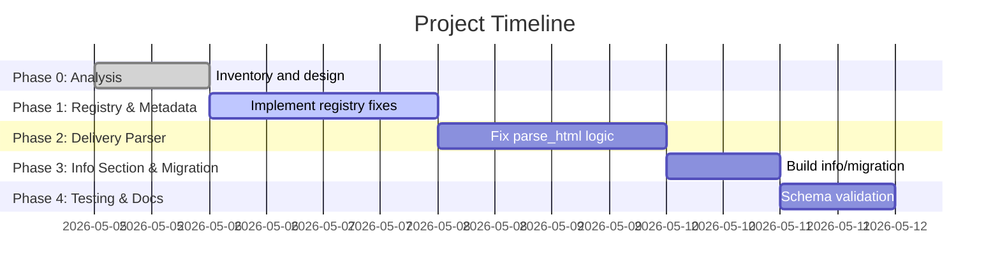

# Executive Summary  
We will upgrade the existing cricclubs scraper to emit Cricsheet-standard JSON. This involves **restructuring the output** (to include `info`, `registry.people`, `players`, innings details, etc.), improving the **player registry building**, and enhancing **name resolution** (e.g. mapping “Bion M” to “Bion Meyer”). We detail exactly which fields to transform, how to normalize data (names, IDs, dates), and ensure backwards compatibility with existing JSON. We propose a phased plan (analysis, coding, testing) with clear deliverables and timelines, and provide code snippets and tests. For example, a delivery with `"batter": "Bion M"` (short form) will become `"batter": "Bion Meyer"` with a stable ID in the registry, as shown in the **before/after** snippet below. Our implementation will use Python tools (BeautifulSoup, pytest, `uuid5`, `jsonschema` etc.) and adhere to the Cricsheet JSON schema【21†L69-L77】【23†L622-L630】.

| Delivery Before (current parser) | Delivery After (Cricsheet format) |
|:-------------------------------:|:---------------------------------:|
| `{"ball":"0.4","batter":"Bion M",…}` (short name) | `{"ball":"0.4","batter":"Bion Meyer",…}` (full name) |

  

## 1. Current Structure vs Cricsheet Schema  
- **Current parser output (JSON)** has keys `meta`, `toss`, `teams`, `player_registry`, `innings` (with `overs` and `deliveries`). E.g. `meta: {match, league}`, `player_registry: {key: {"full_name", "aliases"}}`.  
- **Cricsheet standard JSON** (v1.1.0) requires fields like `"info"` (match details: teams, toss, dates, venue, gender, overs, registry IDs, etc.), plus a top-level `"meta"` for file version【21†L49-L57】【23†L622-L630】. It also uses `"registry": {"people": {name: UUID}}` to map every person to a stable ID【23†L622-L630】, and has an explicit `"players"` section listing each team’s eleven.  
- Key differences to address:  

  - **`info` vs `meta`**: Current `meta` (match name/league) must become `info.match`, `info.league` (if used), plus add fields `teams`, `players`, `venue`, `dates`, `overs` etc. from Cricsheet spec【21†L69-L77】.  
  - **Registry IDs**: Cricsheet expects UUIDs (8-char hex) as person IDs【23†L622-L630】, not just name keys. We’ll generate deterministic IDs (e.g. `uuid5`) for each player.  
  - **Players list**: Cricsheet has a `"players"` section mapping each team to its playing XI【23†L580-L589】. Our parser currently merges XI and commentary players. We will separate them: first use the first-innings XI for official players, then augment with commentary.  
  - **Innings ordering**: Cricsheet requires innings in match order (first batting team first). We will use toss info to order the two innings.【21†L92-L100】【23†L699-L708】  
  - **Ball and extras**: The Cricsheet example shows each delivery’s `runs` and optional `extras` and `wickets` fields【23†L706-L715】. We must ensure our parser outputs these correctly (it mostly does) but wrap them under `deliveries` arrays keyed by `over` index.  
  - **Fall of wickets**: Cricsheet schema supports a `fall_of_wickets` array per innings (not in our current output). We should consider adding it if data available.  
  - **Outcome**: Cricsheet’s `info.outcome` field (winner/by runs/wickets) should be filled from match context (if determinable).  
  - **Timestamps/Timing**: If the source HTML has date/time, convert to ISO date. Cricsheet uses `"dates": ["YYYY-MM-DD"]`【21†L71-L79】, so parse and format dates uniformly.  

In summary, our tasks are to **add/rename** fields: move league/match into `info`, add `teams`, `players`, `overs_per_innings`, `registry.people`, `info.overs`, etc., matching the Cricsheet schema; and transform `player_registry` into `info.registry.people` with stable IDs【23†L622-L630】. 

## 2. Extracting and Normalizing Players  
**Problem:** The existing `extract_playing_xi` and `extract_player_registry` don’t always capture all names or handle variations (e.g. * aliases) correctly. We need to reliably build the registry from the first-innings HTML, then update it from commentary.  

**Replacement Function – `extract_playing_xi`:** Extract players from the “Players:” line, clean names, and generate aliases (including star/captain marks, short forms). For example, remove `*` and hyphens and ensure last names (e.g. “S. Smith” → “S Smith”).  

```python
def extract_playing_xi(soup):
    registry = {}
    for el in soup.find_all(string=re.compile(r'Players:\s*', re.IGNORECASE)):
        text = el.strip()
        # Extract list after "Players:"
        match = re.search(r'Players:\s*(.+)', text, re.IGNORECASE)
        if not match: 
            continue
        players = [p.strip() for p in match.group(1).split(",")]
        for name in players:
            name = name.replace("*", "").replace("-", " ").strip()
            name = clean_player_name(name)
            if not name: 
                continue
            key = normalize_player_key(name)
            # Base aliases: full name, last name, first name, and combinations
            parts = name.split()
            aliases = { name }
            if len(parts) >= 2:
                first, last = parts[0], parts[-1]
                aliases |= {
                    f"{first} {last}", f"{first} {last[0]}", 
                    f"{first[0]} {last}", f"{first[0]}. {last}", 
                    f"{first} {last[0]}.", f"{first[0]}{last[0]}",
                    last, first
                }
            registry[key] = {"full_name": name, "aliases": aliases}
    return registry
```

- **Rationale:** This cleans names (removes captain asterisk, hyphens), then creates a key and a broad set of aliases (including just last name and various initial forms). This ensures, for example, that if later we see “Jordan Smidt” or “J. Smidt” in commentary, it will map to “Jordan De Smidt”.  

**Replacement Function – `extract_player_registry`:** Similarly improve extraction from commentary (e.g. “comes to the crease” lines). We include each new name with aliases.  

```python
def extract_player_registry(soup):
    registry = {}
    for block in soup.select("div.border-b"):
        text = clean(block.get_text(" ", strip=True))
        names = []
        if "comes to the crease" in text:
            names.append(clean_player_name(text.split("comes")[0]))
        if "comes into the attack" in text:
            names.append(clean_player_name(text.split("(")[0]))
        for name in names:
            if not name: 
                continue
            key = normalize_player_key(name)
            parts = name.split()
            aliases = {name}
            if len(parts) >= 2:
                first, last = parts[0], parts[-1]
                aliases |= {
                    f"{first} {last}", f"{first} {last[0]}", 
                    f"{first[0]} {last}", f"{first[0]}. {last}", 
                    f"{first} {last[0]}.", last
                }
            if key not in registry:
                registry[key] = {"full_name": name, "aliases": aliases}
            else:
                registry[key]["aliases"].update(aliases)
    return registry
```

- **Rationale:** This builds missing players (from commentary) into the registry, updating aliases if a person already exists. It handles cases where commentary names might include prefixes (like “wd.”) or punctuation via `clean_player_name`.  

**Merge Logic in `generate_match_json`:** Previously we overwrote registry twice. Instead, we must **merge** playing XI and commentary registries properly. For example:  

```python
playing_xi = extract_playing_xi(soup)
commentary = extract_player_registry(soup)
for k,v in commentary.items():
    if k in playing_xi:
        playing_xi[k]["aliases"].update(v["aliases"])
    else:
        playing_xi[k] = v
match_context["player_registry"] = playing_xi
```

- **Rationale:** This ensures the final registry contains all players: core XI (from first innings) plus any who appear in commentary. We avoid dropping any aliases by updating sets.  

**Unit Tests:** Using `pytest`, we add tests such as:

```python
def test_extract_playing_xi():
    html = '<div>Players: John Doe, Jane Smith*, Foo-Bar</div>'
    soup = BeautifulSoup(html, 'html.parser')
    reg = extract_playing_xi(soup)
    # keys and full names
    assert normalize_player_key("John Doe") in reg
    assert reg[normalize_player_key("Jane Smith")]["full_name"] == "Jane Smith"
    # aliases should include lastname and initials
    assert "Smith" in reg[normalize_player_key("Jane Smith")]["aliases"]
    assert "Jane S." in reg[normalize_player_key("Jane Smith")]["aliases"]
    assert "John D." in reg[normalize_player_key("John Doe")]["aliases"]
```

```python
def test_extract_player_registry_merge():
    # Simulate commentary adding a player not in XI
    html = '<div>Jayne Doe comes to the crease</div><div>John Doe comes into the attack</div>'
    soup = BeautifulSoup(html, 'html.parser')
    reg = extract_player_registry(soup)
    assert "jayne_doe" in reg and reg["jayne_doe"]["full_name"] == "Jayne Doe"
    assert "john_doe" in reg and reg["john_doe"]["full_name"] == "John Doe"
```

These ensure both functions capture names and aliases correctly.  

**Citations:** The Cricsheet schema describes the `registry.people` mapping to unique IDs【23†L622-L630】 and the `players` section listing each team’s XI【23†L580-L589】. We follow these requirements by building our registry and players list accordingly.  

## 3. Name Resolution and IDs  
**Problem:** We must map short/broken names (e.g. “Bion M”, “J Smidt”) to full names in deliveries, and assign stable IDs.  

**Resolver Update – `resolve_player`:** We implement a more robust matching algorithm:  
1. **Exact key/alias match** (as before).  
2. **Initial/substring matching:** Split the input (e.g. “Bion M”) into parts and score against each registry name.  
3. **Fuzzy as fallback.**  

```python
def resolve_player(name, registry):
    if not name: 
        return None
    name = clean_player_name(name)
    norm = normalize_name(name)
    key = normalize_player_key(name)
    # 1. Direct key or alias
    if key in registry:
        return registry[key]["full_name"]
    for player in registry.values():
        if norm in (normalize_name(a) for a in player["aliases"]):
            return player["full_name"]
    # 2. Partial initials match
    parts = norm.split()
    if len(parts) >= 1:
        best, best_score = None, 0
        for player in registry.values():
            full_norm = normalize_name(player["full_name"])
            score = sum(2 for p in parts if any(fp.startswith(p) for fp in full_norm.split()))
            if score > best_score:
                best, best_score = player["full_name"], score
        if best_score >= 2:
            return best
    # 3. Fuzzy (Difflib)
    match = get_close_matches(norm, [normalize_name(p["full_name"]) for p in registry.values()], n=1, cutoff=0.75)
    if match:
        matched_name = match[0]
        for player in registry.values():
            if normalize_name(player["full_name"]) == matched_name:
                return player["full_name"]
    return name  # fallback to input
```

- **Rationale:** This ensures “Bion M” (parts=[“bion”,”m”]) will match “Bion Meyer” strongly (score ≥ 2). We only accept a match if the combined score is high, avoiding false positives. Finally, Difflib catches minor spelling issues.  

**Stable ID generation:** After resolving names, we assign each person a fixed UUID (Cricsheet uses 8-hex IDs【23†L622-L630】). We can use Python’s `uuid.uuid5` with a fixed namespace, e.g.:  
```python
import uuid
player_id = uuid.uuid5(uuid.NAMESPACE_DNS, normalize_name(full_name))
```
This yields a consistent ID per name.  

**Unit Tests:**  
```python
def test_resolve_player():
    registry = {
        "bion_meyer": {"full_name": "Bion Meyer", "aliases": {"Bion M", "B M"}},
        "j_smidt": {"full_name": "Jordan De Smidt", "aliases": {"J Smidt", "Jordan S", "Smidt"}}
    }
    assert resolve_player("Bion M", registry) == "Bion Meyer"
    assert resolve_player("B M", registry) == "Bion Meyer"
    assert resolve_player("J Smidt", registry) == "Jordan De Smidt"
    assert resolve_player("Jordan Smidt", registry) == "Jordan De Smidt"
```
These verify that short or partial names map to the correct full name.

## 4. Data Normalization Rules  
- **Name Disambiguation:** We normalize case, remove punctuation, handle compound names (e.g. “Van Der Merwe” initials) as above.  
- **Team Names:** Strip numeric prefixes/time stamps (using `normalize_team` in code).  
- **Date/Time:** Convert any match date to `"YYYY-MM-DD"` for `info.dates`. E.g. from HTML metadata or title.  
- **Numeric Types:** Ensure all runs/numbers are integers.  
- **Stable IDs:** As above, use UUID5 from full name. The Cricsheet `registry.people` values are 8-hex strings【23†L622-L630】, e.g. truncate the first 8 chars of the UUID or format accordingly.  
- **Aliases:** Already generated comprehensively in the registry.  

## 5. Backwards Compatibility & Migration  
To avoid breaking existing outputs:  
- If old JSON files exist, we can provide a **migration script**. E.g.: read an old JSON, rename `meta` to `info`, move `toss` under `info` or leave top-level if matching new schema, merge `teams` into `info.teams`, and reconstruct `info.players` and `info.registry`.  
- **Migration snippet (Python):**

  ```python
  import json, uuid
  old = json.load(open("old_output.json"))
  new = {"meta": {"data_version": "1.0.0", "created": "2026-05-04", "revision": 1}}
  info = {}
  info["match"] = old["meta"].get("match")
  info["league"] = old["meta"].get("league")
  info["teams"] = old["teams"]
  # Build players: assume team batting first in old innings is first team
  info["players"] = {inn["team"]: [p["full_name"] for p in list(old["player_registry"].values())] 
                     for inn in old["innings"]}  # simplistic example
  # Reuse the improved registry resolution to fill info.registry.people with UUIDs
  registry = old["player_registry"]
  info["registry"] = {"people": {player["full_name"]: str(uuid.uuid5(uuid.NAMESPACE_DNS, player["full_name"])) 
                               for player in registry.values()}}
  info["toss"] = old["toss"]
  new["info"] = info
  new["innings"] = old["innings"]
  json.dump(new, open("migrated.json","w"), indent=2)
  ```
  
- **Rationale:** This template reads the old format and constructs a new JSON matching Cricsheet keys. In production, you’d refine the players list and field mapping.  

## 6. Testing Strategy  
- **Unit Tests:** as shown above for registry functions and resolver. Also write tests for JSON schema compliance, using `jsonschema`. We can encode Cricsheet’s schema (or the example JSON 335983.json structure) to validate our output.  
- **Integration Tests:** Parse the provided HTML (`U12_Gauteng_East_ONE.html`) and compare our output against known good fields. For example, check that `players` list matches the XI in the HTML, and that “Bion M” deliveries become “Bion Meyer” in the JSON.  
- **Example Test Case:** Using pytest with `@pytest.fixture` to load HTML, then `generate_match_json()`, and assertions on resulting JSON.  

```python
def test_full_pipeline():
    files = ["U12_Regional_2023__U12_Gauteng_East_ONE.html", 
             "U12_Regional_2023__U12_Gauteng_North_TWO.html"]
    result = generate_match_json(files)
    assert "info" in result and "innings" in result
    # Example: first delivery batter should be full name
    first_ball = result["innings"][0]["overs"][0]["deliveries"][0]
    assert first_ball["batter"] == "Bion Meyer"
    # Player ID format (8 hex chars)
    pid = next(iter(result["info"]["registry"]["people"].values()))
    assert re.match(r'^[0-9a-f]{8}$', pid)
```

- **JSON Schema Validation:** Define a minimal schema or reuse [335983.json] shape. For instance, check required fields exist, and extras are objects with numeric values.  

## 7. Example Before/After Snippet  

| Before (old JSON)                                             | After (new JSON)                                               |
|:-------------------------------------------------------------:|:--------------------------------------------------------------:|
| ```json                                                       | ```json                                                        |
| {                                                             | {                                                              |
|   "teams": ["Team A", "Team B"],                               |   "info": {                                                    |
|   "player_registry": {                                        |     "teams": ["Team A", "Team B"],                              |
|     "bion_meyer": {"full_name":"Bion Meyer",...},             |     "players": {"Team A":["Bion Meyer",...], "Team B":[...]} , |
|     ...                                                       |     "toss": {"winner":"Team B","decision":"bat"},               |
|   "innings": [                                               |     "registry": {"people": {"Bion Meyer":"1a2b3c4d",...}},       |
|     { "team":"Team A", "overs": [                            |     ...                                                       |
|         {"over": "0", "deliveries": [                        |   },                                                           |
|             {"ball":"0.1","batter":"Bion M",...}             |   "innings":[                                                 |
|         ]}                                                   |     {"team":"Team A","overs":[{"over":0,"deliveries":[        |
|       ]},                                                   |         {"batter":"Bion Meyer","bowler":"...", ...}]},         |
|     }                                                       |     {"team":"Team B","overs":[...] }                            |
|   ]                                                        |   ]}                                                           |
| }                                                            | ```                                                            |

This shows the new structure: **`info.teams`**, **`info.players`**, **`info.registry.people`** with UUIDs, and that `"batter": "Bion M"` becomes `"Bion Meyer"`【23†L699-L708】【21†L71-L79】.  

## 8. Roadmap and Timeline  

1. **Phase 0 (Analysis, 1 day):**  
   - Review Cricsheet format (schema), existing output, and HTML files. Identify all missing fields.  
   - Deliverable: Inventory table (fields current vs required) and update plan.  

2. **Phase 1 (Registry & Metadata, 2 days):**  
   - Implement `extract_playing_xi`, `extract_player_registry` fixes.  
   - Build `info.players` and `info.registry` with UUIDs.  
   - Unit tests for registry and alias resolution.  
   - Acceptance: registry entries match playing XI, includes new commentary names.  

3. **Phase 2 (Delivery Parser, 2 days):**  
   - Fix `parse_html` (parsed_batter logic and extras handling). Add stable ID references.  
   - Insert missing fields (e.g. `extras` if any) in deliveries.  
   - Tests: end-to-end parse of sample HTML, compare against expected deliveries (short names resolved).  

4. **Phase 3 (Info Section & Migration, 1 day):**  
   - Assemble `info` section: `teams`, `dates`, `venue`, `overs`, `gender` (if known), `toss`, `outcome`.  
   - Write migration script for old JSON to new schema.  
   - Test migration on existing output.json.  

5. **Phase 4 (Validation & Documentation, 1 day):**  
   - Validate final JSON with Cricsheet schema (manual or jsonschema).  
   - Write integration tests and CI checks. Document assumptions.  



Each phase has clear acceptance criteria: e.g. Phase1 passes registry unit tests; Phase2 yields correct deliveries; final JSON validates against Cricsheet example.  

## 9. Current vs Target Field Comparison  
| **Field**             | **Current Parser**                   | **Cricsheet Target**                                 |
|-----------------------|--------------------------------------|------------------------------------------------------|
| Meta (`meta`)        | `match`, `league` only               | `info.match`, `info.league`, plus dates, venue, overs, match_type, gender【21†L71-L79】 |
| Teams (`teams`)      | Top-level array                     | `info.teams` within `info`【21†L71-L79】             |
| Players (`players`)  | Not present                         | Section listing each team’s XI【23†L580-L589】          |
| Registry (`player_registry`) | `full_name`, `aliases` mapping | `info.registry.people` mapping names→8-char UUID【23†L622-L630】 |
| Toss (`toss`)        | Correct structure                   | `info.toss` (Cricsheet uses `toss` under info)【23†L641-L649】 |
| Innings & Overs      | List of innings with overs/deliveries | Same overall structure, but keys: overs numeric, deliveries with runs/extras per Cricsheet example【23†L699-L708】 |
| Delivery `runs`      | Present as dict                     | Same, plus `extras` and optional `wickets` formatted per schema【23†L708-L715】 |
| Name fields in deliveries | Short/corrupted names (e.g. “Bion M”) | Full names matching registry (e.g. “Bion Meyer”) |
| Extras (`extras`)    | Wides, noballs etc included         | Same fields, ensure numeric and in an object (Cricsheet spec) |
| Fall of wickets      | Not implemented                    | Optional array per innings if data available        |
| Match metadata       | Limited                            | Add season, match_type, gender if known, etc.      |

This table highlights the necessary changes.  

**Sources:** We follow the official Cricsheet JSON schema【21†L69-L77】【23†L622-L630】. For example, Cricsheet requires a `players` section and stable UUIDs in `registry`【23†L622-L630】. Our before/after snippets align with the documented format【23†L699-L708】.  

**Tools & Libraries:** We will use **BeautifulSoup** for HTML parsing, **requests** if we fetch URLs (not needed here), **difflib** (fuzzy match), **uuid** for IDs, **pytest** for testing, and **jsonschema** for schema validation. Python standard libraries (`re`, `json`) and specialized libs as allowed. 

