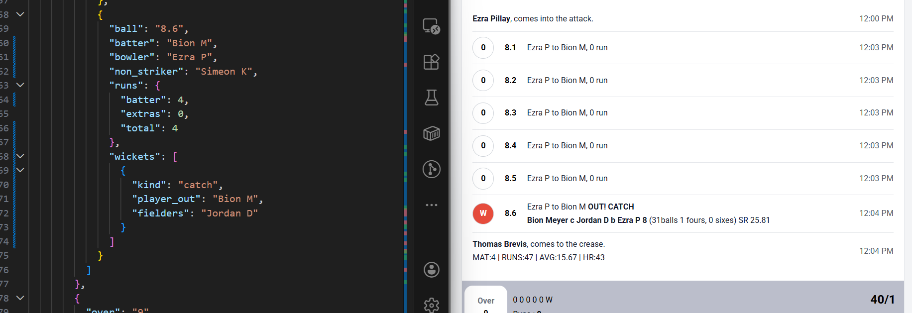

1. full name mappings should be displayed ball delivery data
2. need to put one fix at no ball + physical run / leg bye + physical run /wide + physical run / bye + physical run
   
3. after the wicket the out player is updating
